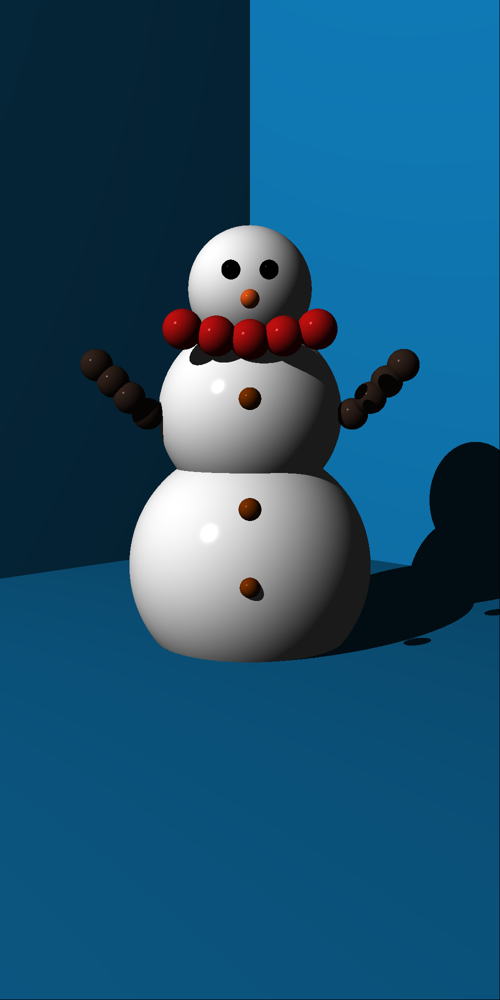
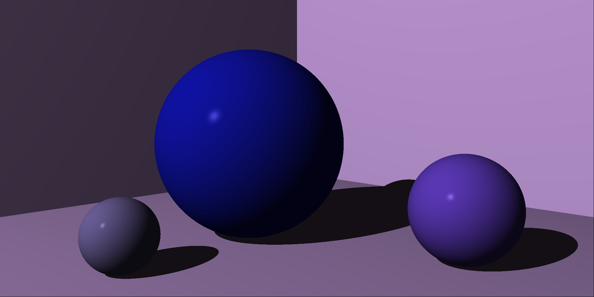

# Ray Tracer

This project is a basic Ray Tracer based on the book "The Ray Tracer Challenge" by James Buck and it was created using **test driven development**.

## Generated scenes

Here are some of the generated scenes. You can visit the [results](./results) directory for more.

### Snowman

### Purple light

## Usage manual

### Ray tracer execution

Inside the `src` directory execute the following command:

    python main.py

The `main.py` file contains the scene that wants to be generated. Feel free to modify it to try new scenes.

### Unit test exeution

Inside the `src` directory execute the following command:

    python -m pytest .\tests

## Credits

- [Angie Solís](https://github.com/AngieS23)
- [Emilia Víquez](https://github.com/EmiliaViq)